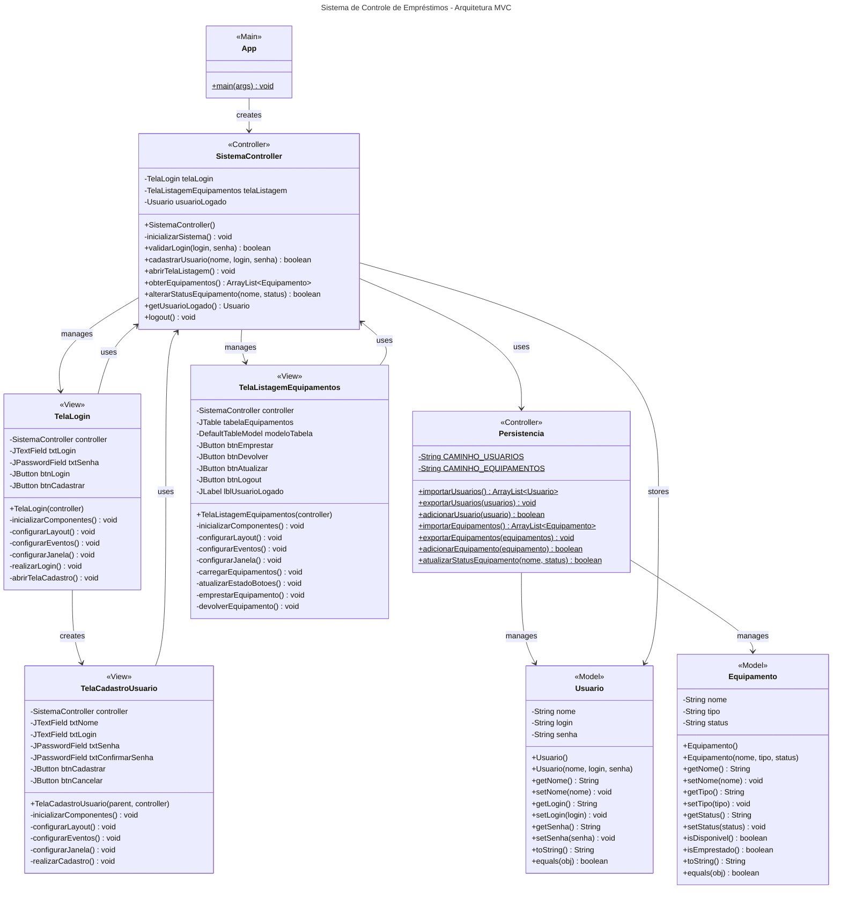

# Diagrama de Classes - Sistema de Controle de Empréstimos

```mermaid
---
title: Sistema de Controle de Empréstimos - Arquitetura MVC
---
classDiagram
    %% Classes do Model
    class Usuario {
        -String nome
        -String login
        -String senha
        +Usuario()
        +Usuario(nome, login, senha)
        +getNome() String
        +setNome(nome) void
        +getLogin() String
        +setLogin(login) void
        +getSenha() String
        +setSenha(senha) void
        +toString() String
        +equals(obj) boolean
    }
    
    class Equipamento {
        -String nome
        -String tipo
        -String status
        +Equipamento()
        +Equipamento(nome, tipo, status)
        +getNome() String
        +setNome(nome) void
        +getTipo() String
        +setTipo(tipo) void
        +getStatus() String
        +setStatus(status) void
        +isDisponivel() boolean
        +isEmprestado() boolean
        +toString() String
        +equals(obj) boolean
    }
    
    %% Classes do Controller
    class SistemaController {
        -TelaLogin telaLogin
        -TelaListagemEquipamentos telaListagem
        -Usuario usuarioLogado
        +SistemaController()
        -inicializarSistema() void
        +validarLogin(login, senha) boolean
        +cadastrarUsuario(nome, login, senha) boolean
        +abrirTelaListagem() void
        +obterEquipamentos() ArrayList~Equipamento~
        +alterarStatusEquipamento(nome, status) boolean
        +getUsuarioLogado() Usuario
        +logout() void
    }
    
    class Persistencia {
        -String CAMINHO_USUARIOS$
        -String CAMINHO_EQUIPAMENTOS$
        +importarUsuarios()$ ArrayList~Usuario~
        +exportarUsuarios(usuarios)$ void
        +adicionarUsuario(usuario)$ boolean
        +importarEquipamentos()$ ArrayList~Equipamento~
        +exportarEquipamentos(equipamentos)$ void
        +adicionarEquipamento(equipamento)$ boolean
        +atualizarStatusEquipamento(nome, status)$ boolean
    }
    
    %% Classes da View
    class TelaLogin {
        -SistemaController controller
        -JTextField txtLogin
        -JPasswordField txtSenha
        -JButton btnLogin
        -JButton btnCadastrar
        +TelaLogin(controller)
        -inicializarComponentes() void
        -configurarLayout() void
        -configurarEventos() void
        -configurarJanela() void
        -realizarLogin() void
        -abrirTelaCadastro() void
    }
    
    class TelaCadastroUsuario {
        -SistemaController controller
        -JTextField txtNome
        -JTextField txtLogin
        -JPasswordField txtSenha
        -JPasswordField txtConfirmarSenha
        -JButton btnCadastrar
        -JButton btnCancelar
        +TelaCadastroUsuario(parent, controller)
        -inicializarComponentes() void
        -configurarLayout() void
        -configurarEventos() void
        -configurarJanela() void
        -realizarCadastro() void
    }
    
    class TelaListagemEquipamentos {
        -SistemaController controller
        -JTable tabelaEquipamentos
        -DefaultTableModel modeloTabela
        -JButton btnEmprestar
        -JButton btnDevolver
        -JButton btnAtualizar
        -JButton btnLogout
        -JLabel lblUsuarioLogado
        +TelaListagemEquipamentos(controller)
        -inicializarComponentes() void
        -configurarLayout() void
        -configurarEventos() void
        -configurarJanela() void
        -carregarEquipamentos() void
        -atualizarEstadoBotoes() void
        -emprestarEquipamento() void
        -devolverEquipamento() void
    }
    
    class App {
        +main(args)$ void
    }
    
    %% Relacionamentos
    App --> SistemaController : creates
    SistemaController --> TelaLogin : manages
    SistemaController --> TelaListagemEquipamentos : manages
    SistemaController --> Persistencia : uses
    TelaLogin --> TelaCadastroUsuario : creates
    TelaLogin --> SistemaController : uses
    TelaCadastroUsuario --> SistemaController : uses
    TelaListagemEquipamentos --> SistemaController : uses
    Persistencia --> Usuario : manages
    Persistencia --> Equipamento : manages
    SistemaController --> Usuario : stores
    
    %% Anotações das camadas
    class Usuario {
        <<Model>>
    }
    class Equipamento {
        <<Model>>
    }
    class SistemaController {
        <<Controller>>
    }
    class Persistencia {
        <<Controller>>
    }
    class TelaLogin {
        <<View>>
    }
    class TelaCadastroUsuario {
        <<View>>
    }
    class TelaListagemEquipamentos {
        <<View>>
    }
    class App {
        <<Main>>
    }
```